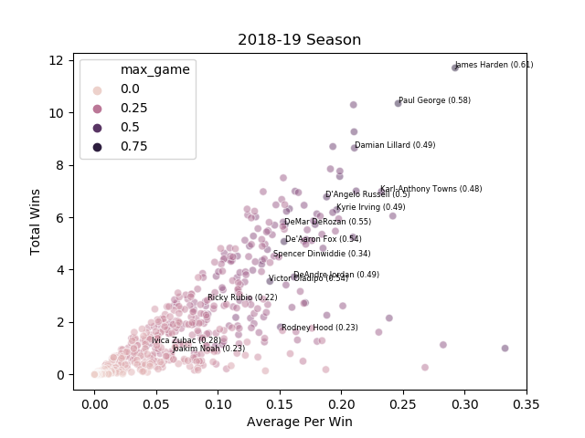
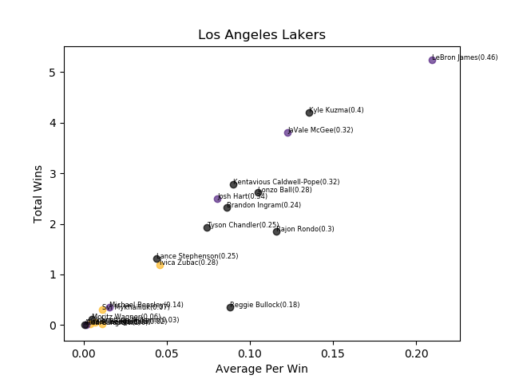
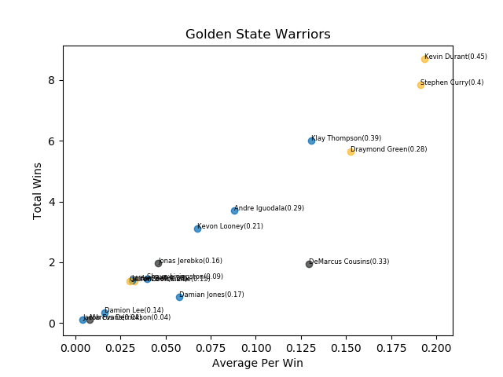

# NBA Wins Contributed Statistic 

In every sport determining which player reigns supreme is on the forefront of fans minds. In no sport is this more prevelant than basketball. Debates constantly rage about who the greatest player of all time is, who should be MVP this year, and who the best player in the world is right now. Due to many moving pieces within the game, the different ways players provide value, and the difference in team compositions value in the NBA is difficult to quantify and makes these debates very subjective. Take this years MVP race, five of the current MVP front runners Giannis Antetokounmpo, James Harden, Kevin Durant, Paul George, and Nikola Jokic highlight four characteristics people usually attribute to MVP. 

1. **Giannis Antetokounmpo** - The best player on the best team in the league.
2. **James Harden** - The player doing everything for their team.
3. **Kevin Durant** - The best player in the world. Usually this is Lebron James (IMO).
4. **Paul George** - The best two-way (combined offensive and defensive) player.
5. **Nikola Jokic** - The feel-good, surprise contender, with actual skill

As a result of basketball's intricacies, many stats exist to rank the best individual players in the league. These stats like Player Efficiency Rating (PER), Player Impact Estimate (PIE), Win Shares, Value Over Replacement Player (VORP), and Box Score Plus/Minus (BPM) all present unique ways to evaluate talent. With all of the advanced metrics out there and computing never more powerful, there are surprisingly few advanced metrics that place an emphasis on winning, game by game analysis, possession by possession outcomes, team composition, and durability.

# Introducing Wins Contributed

Wins contributed measures players contribution in every win. By doing this, we can graph the MVP race for any given year game by game. Below is a video showing the MVP race using Wins contributed for games 119 through 1023 in the 2018-2019 regular season. If you would like to see the full video, videos for other years, and plenty of other graphs describing previous NBA Season, [click here](https://github.com/jacobfulfyll/wins_contributed/tree/master/Graphs):

## How is this calculated? 

By making each game a seperate entity with a definitive outcome, Wins Contributed aims to show how many wins a player contributes to his team over the course of any given time period. It is calculated on a game by game basis using 6 distinct steps. A summary of the steps is provided below, but if you're looking for a complete calculation, [click here](https://github.com/jacobfulfyll/wins_contributed/blob/master/fullCalculation.md)

  1. **Determine Which Team Won The Game**
    - In Wins Contributed only players on the winning team receive value
    - Each win is worth 1 point and that 1 point is divided between each of the players on the winning team, based on their value provided in that game
  2. **Assign Value To Each Player**
    - Wins Contributed analyzes each possession in a game and awards players points based on the outcome of each possession. Below are two examples of the many adjustments made to typical box score stats using possessional data 
      - If a player grabs an offensive rebound, but the team can't turn that rebound into points, the offensive rebound is deemed worthless.
      - An assist on a three pointer is worth more than an assist on a two pointer
    - Value is determined on a game by game basis
      - Offensive Value = Points Scored On Given A Possession - Value Of A Possession For The Winning Team
      - Defensive Value = Value Of A Possession For The Losing Team
      - Value Of A Possession For The Winning Team = Winning Team Points Scored / Winning Team Total Possessions
      -  Value Of A Possession For The Losing Team = Losing Team Points Scored / Losing Team Total Possessions
        - Value of possessions for each team is calculated on a game by game basis. This is unlike most advanced metrics which take into account teams seasonal performances. I think this provides an interesting way to look at actual match ups, not shown by average data.
  3. **Normalize Value To Reality**
    - Box score stats are great, but they also have their limitations. To make up for some of these limitations the value determined through the box score stats is normalized using offensive and defensive ratings.
      - Offensive and Defensive Ratings measure how many points were scored/surrendered for a given player or the entire team per 100 possessions
    - Wins Contributed calculates an offensive and defensive factor for each player for each game
      - Player Offensive Factor = Player Offensive Rating / Team Offensive Rating
      - Player Defensive Factor = Player Defensive Rating / Team Defensive Rating
    - Offensive/Defensive Factors above 1 increase a players value for every Offensive/Defensive statistic because the team was playing better than average while they were on the floor
    - Factors below 1 decrease players value for the opposite reason
  4. **Negative Values Adjustments**
    - Final values contributed from the box score statistics and ratings factor for a player can be negative. This creates an issue when trying to assign each player a percentage of the win.
    - To fix this, Wins Contibuted sets the player with the lowest value at the end of the game to 0 and calculates all other values using them as a baseline.
      - If the lowest value for a player was -6 and the second lowest was -4, the -6 value is set to 0 and the -4 value is set to 2
      - This means the player who contributed the least calculated value in every win is given 0 Wins Contributed
  5. **Playing Time Adjustments**
    - Because Wins Contributed considers both positive and negative impacts it is important to give more credit to those who play more. It is a lot easier to go one for one from the field and provide positive value than it is to take 20 shots and provide positive value. 
    - A superstar having a bad game may miss many shots resulting in slightly less value provided in the aggregate metric, but provide much more to the win in reality.
    - To fix this we perform one more adjustment to get a final value provided for each player
      - Playing Time Adjustments = Seconds Played / (Total Seconds In Game * 5)
        - Total seconds in a game is multiplied by 5 to account for all 5 players on the floor
  6. **Calculate Wins Contributed**
    - Now we have a fair value for how much each player has contributed to this win
    - Wins Contributed = Player Value / Sum Of All Player Values
      - The wins each player contributes in a given game is their percentage of the total value in the game.

# What good is this?

**Unlike many other stats, Wins Contributed does not purely value efficiency, team performance, or counting specific metrics, rather it attempts to blend all three.**
  - From an efficiency perspective it rewards players for their contributions, penalizes them for their failings and relates it all to the value of a possession in the associated game. 
  - It values team performance above all because you only receive points when your team wins. It also incorporates team performance by factoring in the how the team performs while each player is on the floor. 
  - Finally it values counting stats although not in a typical way. Wins contributed turns most of the typical counting stats into efficiency based metrics, but values longevity and durability by counting the amount of wins players contribute. By doing this it gives credit to players who have had successful NBA careers on great teams, but may have been overlooked for one reason or another. It points out who actually does what matters most in basketball and all sports, win the game.

### League and Team Scatter Plots
Creating scatter plots with the sum of a player's wins contributed and their average wins contributed per win shows both who contributes the most in a single win and who has contributed the most to wins in total. Additonally, next to players name is a number which represents their max win contribution for any single game on the entire season. This gives us an idea of who has the capacity to contribute in a big way, even if they don't do it consistently yet. Below is the 2018-19 Season. 15 players have been labeled, 10 with the highest wins for a single game and 5 randomly generated.

This also allows us to see team contributions in from a new perspective. Below you'll see the contributions for each player on the Los Angeles Lakers and Golden State Warriors:

 

### Insight Still To Come
1. Nightly Best Players Tool:
  - Because Wins Contributed is calculated on a per game basis it can provide a nightly look at players who contributed the most to their team in any given night. 
2. Career Arc Comparison:
  - At the end of the day it values wins and compares each player to their teammates. Because of this, it has the unique ability to compare players across generations throughout different points in their career. 
3. Contract Value Contributiosn:
  - With wins being correlated to team's financial success, pegging wins contributed to the amount of dollars earned for each player gives insight into which players are the most under and over paid.
4. Regular Season vs Playoffs:
  - Everyone who watches the NBA knows regular season success doeesn't always translate to playoff success. Win's contributed provides a way to compare how players skillsets transition from the grind of the regular season to the competitiveness of the playoffs.
5. Value Contributed In Losses:
  - Which players contribute a lot of value in losses. Is there a differen in how some players perform in losses compared with wins? Finding out the value players contirbute in losses can give us a fuller picture of value through Wins Contributed.

# What Are The Flaws

No stat is perfect, so what are the flaws in Wins Contributed?

1. *Inadequacy in valuing defense, especially perimeter defense:*
    - Wins Contributed gives credit for steals, blocks, and defended field goals, but can't adequately measure "individually bad defense." This is challenging for all basketball stats, so I was okay making a concession in this area.
2. *Evaluating players compared to teammates on a game by game basis:*
    - I believe this can be seen as a weakness, but was also something I wanted to be in the stat. Playing basketball myself, I'm biased towards believing players have on days and off days, so at least one stat should evaluate players on a game by game basis. However, this runs the risk of penalizing or rewarding players based on luck by looking at outcomes on such a small sample size. I do believe over the long run you will get interesting aggregate information that may differ from the agreggate information collected on a seasonal basis and it will hopefully be more true to reality, luck included.
3. *0 Wins For The Worst Player:*
    - Because it evaluates most of the metrics on efficiency and deems that the player with the lowest value provided at the end of the game earns 0 Wins Contributed, superstars having bad games will sometimes end up with duds. They make and miss more shots than players with smaller roles and have the ball more to do both great and terrible things on the court. 
4. *Arbitrary Percentages For Value Contributions:* 
    - This is easy when there is only one person responsible for a positive or negative outcome. If James Harden turns the ball over, he loses the entire value of that possession, if he hits an unassisted shot that wasn't preceded by an offensive rebound he received the entire value of the points he created minus the value of a possession. When multiple players are involved, each player receives or loses a percentage of that value created or lost. The big flaw is that those percentages are fixed and although seemingly logical, they are arbitrary. Eventually the goal is to complete more sophisticated modeling to test various percentage splits to come up with percentages that best reflect reality.
5. *Lack of Fringe Statistics:* 
    - Wins Contributed does not consider some fringe intangible statistics, things like loose balls, boxouts, and deflections which certainly provide value towards winning basketball games. I hope to add these by the beginning of the 2019-2020 season.

# Which Player Has Contributed The Most Wins over The Last Three Seasons?

Below is the actual output table from the first game of the 2018-2019 season between the Boston Celtics and the Philadelphia 76ers. It shows how much of a players game_value score was provided by each of the stats analyzed, the actual Game Value Score, and finally the Wins Contributed:

| Player           | Made_FG_Score | Ast_Score | Orebs_Score | Drebs_Score | TO_Score | Stls_Score | Blks_Score |  FT_Score | DFG_Score | Sast_Score | FT_Ast_score | Missed_FG_score | Def_Fouls_Score | Game_Value  | Wins_Contributed |
|:----------------:|:---------:|:---------:|:-----------:|:-----------:|:--------:|:----------:|:------------:|:---------:|:---------:|:----------:|:------------:|:---------------:|:---------------:|:-----------:|:----------:|
|Jayson Tatum      | 10.6      | 1.73      | 1.16        | 1.19        | -0.74    |   0.85     |            0 |     1.76  |         0 |   0.45     |            0 |        -4.47    |        0.67     |      13.23  |    0.247   |
|Gordon Hayward    | 3.29      | 0         | 0.60        | 0.48        |  0       |   3.22     |            0 |    -1.13  |   1.20    |   0.41     |            0 |        -4.24    |       -0.22     |      3.63   |    0.109   |
|Al Horford        | 3.13      | 0.97      | 0           | 0.59        | -2.65    |   0        |      5.034   |   0.072   |   5.59    |          0 |     0.16     |        -2.65    |       -0.23     |      10.02  |    0.214   |
|Jaylen Brown      | 4.43      | 0.87      | 0           | 0.27        | -1.96    |   0        |            0 |    0.11   |         0 |   0.35     |            0 |        -7.85    |        0.84     |     -2.92   |   0.046    |
|Kyrie Irving      | 2.17      | 3.11      | 0           | 0.55        | -2.77    |   0        |            0 |     1.28  |         0 |   0.37     |            0 |        -10.1    |        -1.34    |     -6.76   |           0|
|Marcus Morris     | 6.87      | 0         | 0.68        | 0.95        | -0.95    |   1.19     |            0 |          0|         0 |          0 |            0 |        -4.77    |        -3.93    |    0.047    |   0.059    |
|Terry Rozier      | 5.86      | 0.31      | 0           | 1.43        | -0.94    |   0        |      1.67    |          0|   1.33    |   0.37     |            0 |        -4.72    |        0.63     |      5.96   |    0.144   |
|Marcus Smart      | 2.69      | 1.50      | 0           | 0.48        | -1.50    |   0        |            0 |    0.14   |         0 |          0 |            0 |       -0.75     |        -1.17    |      1.39   |   0.087    |
|Aron Baynes       | 3.71      | 1.38      | 0.86        | 0.15        | -0.89    |   0        |            0 |       0   |   1.16    |          0 |            0 |        -3.58    |        -1.21    |      1.57   |   0.068    |
|Daniel Theis      | 0         | 0         | 0           | 0.17        |  0       |   0        |            0 |       0   |         0 |          0 |            0 |               0 |        -1.05    |     -0.87   |   0.010    |
|Semi Ojeleye      | 0         | 0         | 0           | 0.30        |  0       |   0        |            0 |       0   |         0 |          0 |            0 |               0 |               0 |     0.30    |  0.004     |
|Guerschon Yabusele| 0         | 0         | 0           | 0           |  0       |   0        |            0 |       0   |         0 |          0 |            0 |               0 |               0 |            0|  0.004     |
|Brad Wanamaker    | 1.10      | 0         | 0           | 0.30        |  0       |   0        |            0 |       0   |         0 |          0 |            0 |               0 |               0 |      1.40   |   0.002    |

